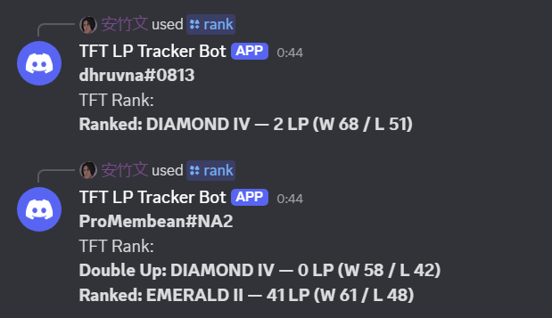
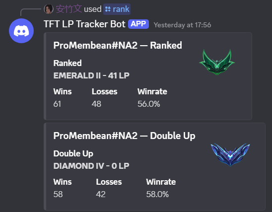
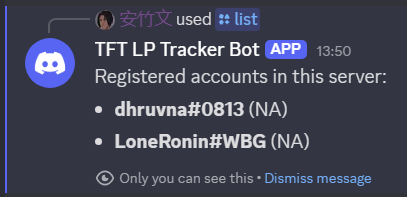
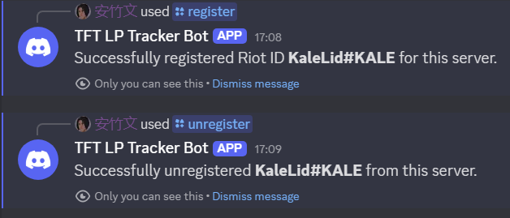
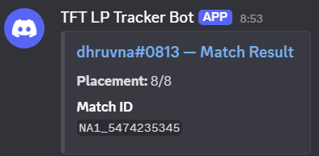
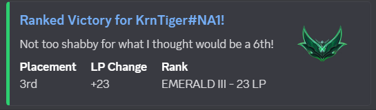

# TFT Int Log Tracker:

A Discord bot built with **Node.js**, **discord.js**, and the **Riot Games API** that allows users to register Riot IDs per server, list registered accounts, and fetch competitive data (with plans for live match tracking).

## Features

### Riot ID Registration (Per Server)
- Register one or more Riot IDs to a Discord server
- Data is isolated per server using the Discord `guildId`

### List Registered Accounts
- `/list` displays all Riot IDs registered in the current server
- Format: `gameName#tagLine (Region)`

### Rank Lookup
- `/rank` fetches TFT ranked data
- Supports region selection via dropdown (reduces user error)
- Includes a link to external match/rank pages (e.g., LeagueOfGraphs) when available

### Persistent Storage
- Local JSON database:
  - `./user_data/registrations.json`
- Automatically:
  - Creates the `user_data/` directory if missing
  - Creates `registrations.json` if missing
- Atomic writes (temp file + rename)

### Riot API Wrapper
- Centralized Riot API logic in `riot.js`
- Handles:
  - Riot ID → PUUID
  - Platform routing (e.g. `na1`) → regional routing (e.g. `americas`)

## Planned / In Progress

### Automated Match Tracking (TFT)
Goal: the bot posts a match result embed automatically after a registered user finishes a game.
- Poll most recent matchId periodically (since “current game” endpoint is unreliable)
- Detect newly completed match by comparing to saved `lastMatchId`
- Fetch match details + current rank snapshot
- Compute LP delta from previous saved snapshot
- Post result embed with match link

### Leaderboard
- Server leaderboard by rank/LP

### Match History / Detail Commands
- `/lastmatch` command
- Optional match history browsing


# Progress
**Day 1: 1/22/2026**
- Discord bot created
- Riot API key refreshed daily for temporary use
- Basic node.js structure created
- Basic ping command created (/ping)
- Can fetch TFT Ranked profile summary (/rank)
- All commands need to be run manually, goal is to try automatic implementation soon



**Day 2: 1/23/2026**
- Deciding on format of Discord embeds
- {Ranked/Double Up} {Victory/Defeat} for {gameName#tagLine}
- **Placement |   Rank   | {Win/Loss}**                        IMAGE?
-   1st-8th   |  D4 2LP  |  +- X LP
- Now stores registered users, need to update rank command to reflect this next
- Creates file if it didn't exist, updates atomically
- Changed platform/routing to just default to NA and to have a dropdown menu to reduce user error
Live Match Tracking
- Use league of graphs to embed the link for the match after it is finished
- Data dragon can embed some image, maybe their little legend?





**Day 3: 1/24/2026**
- Rank command now supports dropdown, no more manual input
- Fixed issue with only one embed sending when user has ranked + double up to show
- League of graphs link shows on rank command
- Added an unregister command
- After a game, embed is sent in discord with a link to the LeagueOfGraphs page. WIP
- Keeping snapshots of last LP, last game id, etc to make this possible




**Day 4: 1/25/2026**
- Fixed link structure for post game tracking
- Better updating json to track lp snapshots without error
- Plenty of redundant code is currently present at EOD, but functionality works. Next up, we trim the fat



# Project Structure

```text
.
├── index.js                # Bot entry point
├── register-commands.js    # Registers slash commands
├── commands/
│   ├── register.js         # /register
│   ├── unregister.js       # /unregister
│   ├── list.js             # /list
│   └── rank.js             # /rank
├── riot.js                 # Riot Games API wrapper
├── storage.js              # JSON persistence layer
├── data/
│   └── registrations.json  # Auto-created DB
└── README.md
```