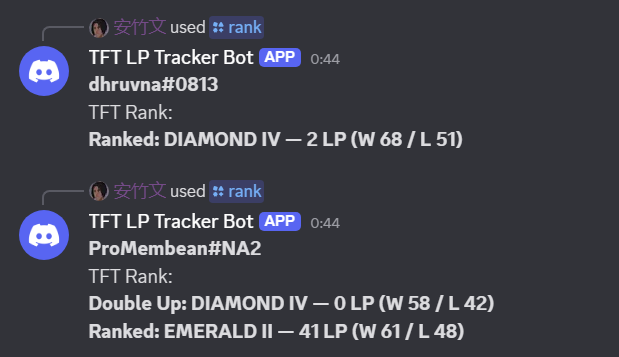
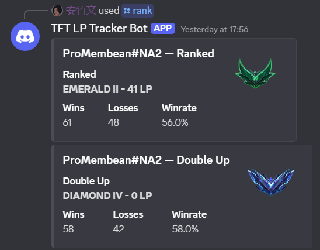
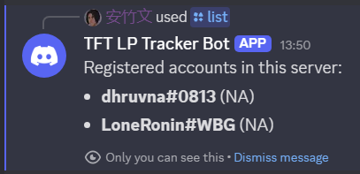
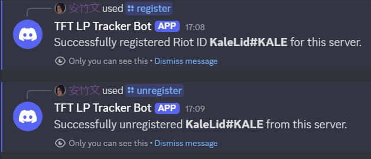
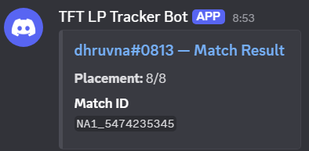
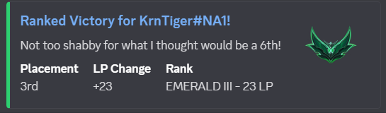
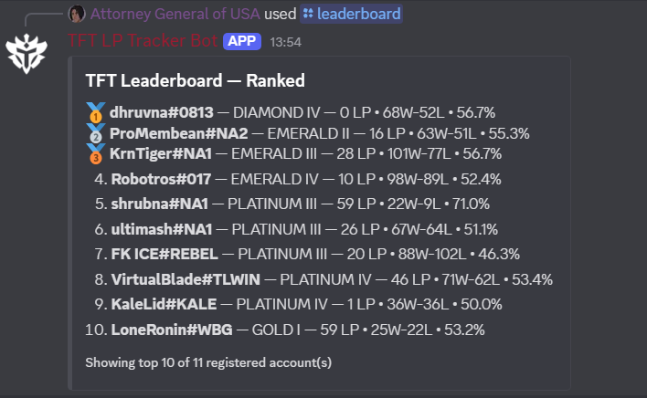
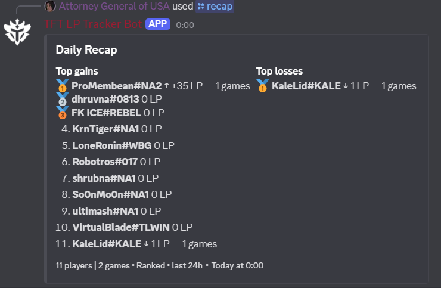
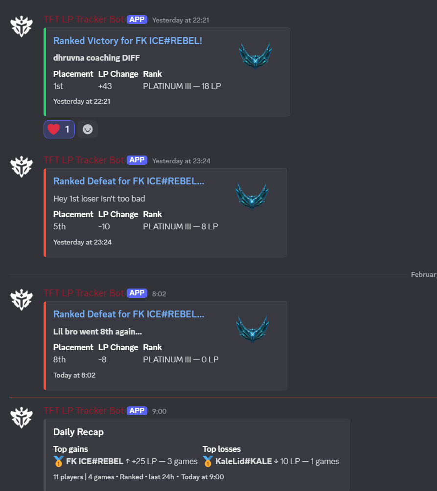

# TFT Int Log Tracker:

A Discord bot built with **Node.js**, **discord.js**, and the **Riot Games API** that lets each server register Riot IDs, view rank data, and post automated match results.

> **Game scope (current):**
> - **TFT:** Full feature set (registration, rank, leaderboard, recap, autopost tracking).
> - **LoL:** Partial support (registration + rank snapshots + automated match-result posts).
> - **Not yet parity with TFT:** LoL leaderboard/recap and LoL-specific recap automation.

## Features

### Riot ID Registration (Per Server)
- Register one or more Riot IDs to a Discord server
- Data is isolated per server using the Discord `guildId`

### List Registered Accounts
- `/list` displays all Riot IDs registered in the current server
- Format: `gameName#tagLine (Region)`

### Rank Lookup
- `/rank` shows stored ranked snapshots for registered accounts
- Supports **TFT**, **LoL**, or **both** via the `game` option
- TFT entries link to LeagueOfGraphs; LoL entries link to the player profile page

### Persistent Storage
- Local JSON database:
  - `./user_data/registrations.json`
- Automatically:
  - Creates the `user_data/` directory if missing
  - Creates `registrations.json` if missing
- Atomic writes (temp file + rename)

### Riot API Wrapper
- Centralized Riot API logic in `riot.js`
- Handles:
  - Riot ID → PUUID
  - Platform routing (e.g. `na1`) → regional routing (e.g. `americas`)

## Automated Match Tracking (TFT + LoL)

The bot automatically posts a match result embed after a registered player finishes a tracked game.

Current behavior:
- Periodically polls each registered account's most recent match ID (TFT + LoL)
- Detects newly completed matches by comparing against stored `lastMatchId`
- Fetches match details and current ranked snapshot
- Computes LP delta from the previously saved snapshot
- Posts a styled embed with game-specific fields (for example, TFT placement or LoL K/D/A), LP change, and rank context when available

## Seasonal Reset Support
- `/resetranks confirm:true` clears TFT rank snapshots + recap history for the server.
- `/resetranks confirm:true before_date:YYYY-MM-DD` clears only accounts whose latest tracked TFT match happened **before** that UTC date and stores the season cutoff in `registrations.json` for ongoing polling.
- By default reset keeps `lastMatchId` / `lastMatchAt` so old games are not replayed; use `clear_match_cursor:true` only if you intentionally want a full cursor wipe.

# TODO
### Parity / Feature Gaps
- LoL `/leaderboard` parity (current leaderboard is TFT-only)
- LoL `/recap` parity and LoL recap autopost support
- Optional per-game channel routing/filter presets (finer TFT vs LoL control)
- change time that displays to the time of the game? if possible (requires utc -> human readable time conversion)
- change champ name to damage done
- recap stuff/leaderboard stuff


### Platform / Operations
- Host bot 24/7
- Patch notes / release changelog

### Match History / Detail Commands
- `/lastmatch` command
- Optional match history browsing

-----------------------------------------

# Progress
**Day 1: 1/22/2026**
- Discord bot created
- Riot API key refreshed daily for temporary use
- Basic node.js structure created
- Basic ping command created (/ping)
- Can fetch TFT Ranked profile summary (/rank)
- All commands need to be run manually, goal is to try automatic implementation soon



**Day 2: 1/23/2026**
- Deciding on format of Discord embeds
- {Ranked/Double Up} {Victory/Defeat} for {gameName#tagLine}
- **Placement |   Rank   | {Win/Loss}**                        IMAGE?
-   1st-8th   |  D4 2LP  |  +- X LP
- Now stores registered users, need to update rank command to reflect this next
- Creates file if it didn't exist, updates atomically
- Changed platform/routing to just default to NA and to have a dropdown menu to reduce user error
Live Match Tracking
- Use league of graphs to embed the link for the match after it is finished
- Data dragon can embed some image, maybe their little legend?





**Day 3: 1/24/2026**
- Rank command now supports dropdown, no more manual input
- Fixed issue with only one embed sending when user has ranked + double up to show
- League of graphs link shows on rank command
- Added an unregister command
- After a game, embed is sent in discord with a link to the LeagueOfGraphs page. WIP
- Keeping snapshots of last LP, last game id, etc to make this possible




**Day 4: 1/25/2026**
- Fixed link structure for post game tracking
- Better updating json to track lp snapshots without error
- Plenty of redundant code is currently present at EOD, but functionality works. Next up, we trim the fat
- Operation works but is unstable



**Day 5: 1/26/2026**
- Match tracking fully functional and stable
- Improved match result embed design (Victory / Defeat cards)
- Fixed LP snapshot overwrites and async embed bugs
- Refactored polling to safely persist rank and match state
- System now stable enough for feature iteration and cleanup



**1/27/2026 - 2/6/2026**
- Recap columns only show either wins or losses, win column no longer shows negatives / zeros
- Update account info with rich information (include W/L/etc EVERYTIME)
- Autopost recap every morning at 9AM 
- Added command to config recap ```/recapconfig```
- Added LP standardization so that division changes are handled properly (IRON: 0, PLATINUM: 1600, MASTERS: 2800+)
- Various bug fixes



**2/7/2026 - 2/12/2026**
- 


# Project Structure

```text
.
├── index.js                # Bot entry point
├── register-commands.js    # Registers slash commands
├── commands/
│   ├── register.js         # /register
│   ├── unregister.js       # /unregister
│   ├── list.js             # /list
│   └── rank.js             # /rank
│   ├── rank.js             # /rank
│   ├── leaderboard.js      # /leaderboard
│   ├── recap.js            # /recap
│   ├── recapconfig.js      # /recapconfig
│   └── setchannel.js       # /setchannel

├── riot.js                 # Riot Games API wrapper
├── storage.js              # JSON persistence layer
├── utils/
│   ├── recap.js            # Recap helpers
│   ├── rateLimiter.js      # Riot API rate limiting helpers
│   ├── tft.js              # TFT-specific helpers
│   └── utils.js            # Utilities for other files
├── user_data/
│   └── registrations.json  # Auto-created DB
└── README.md
```

## Configuration

The bot requires the following environment variables:

- `DISCORD_BOT_TOKEN`  
  Discord bot token

- `RIOT_TFT_API_KEY`  
  Riot Games API key (TFT endpoints)

- `RIOT_LOL_API_KEY`  
  Riot Games API key (LoL endpoints)

Optional:
- `MATCH_POLL_INTERVAL_SECONDS` (default: 60)  
  How often to poll for new matches

- `MATCH_POLL_PER_ACCOUNT_DELAY_MS` (default: 250)  
  Delay between polling each account to avoid rate limits

- `RECAP_AUTOPOST_HOUR` (default: 9)  
  Local server hour (0-23) for daily recap autopost

- `RECAP_AUTOPOST_MINUTE` (default: 0)  
  Local server minute (0-59) for daily recap autopost

